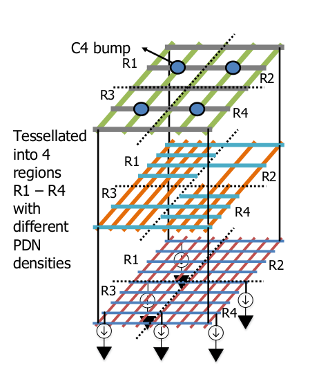
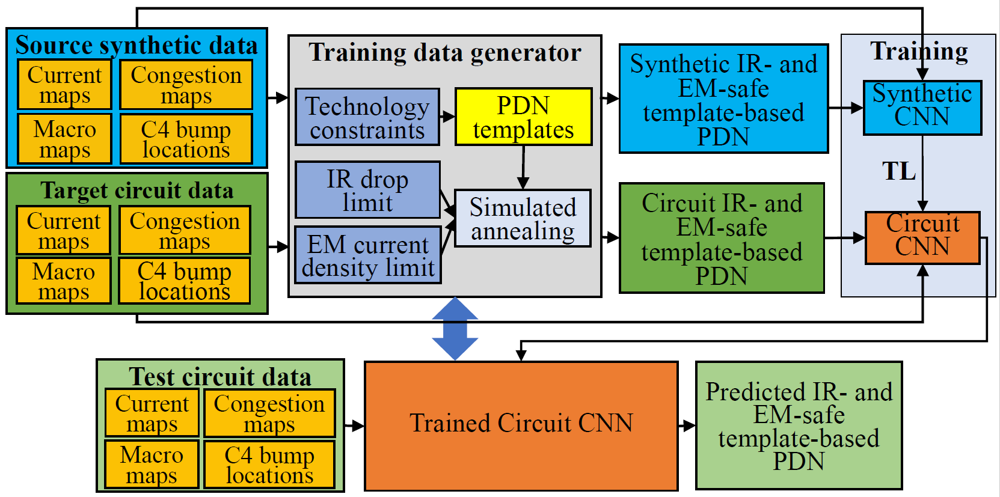

# OpeNPDN: Neural networks for automated synthesis of Power Delivery Networks (PDN)
[](https://commons.wikimedia.org/wiki/File:Blue_Python_3.6_Shield_Badge.svg)
[](https://github.com/The-OpenROAD-Project/OpeNPDN/archive/master.zip)
[](https://github.com/The-OpenROAD-Project/OpeNPDN/tree/master)
[](https://github.com/The-OpenROAD-Project/OpeNPDN/issues)
[](https://opensource.org/licenses/BSD-3-Clause)

Machine learning-based on-chip power delivery network (PDN) synthesis at the placement stage.  The synthesis is based on a set of predefined, technology-specific set of templates. These templates are defined across multiple layers and vary in their metal utilizations in the intermediate layers. Dense templates are good for power integrity but bad for congestion. The problem of optimized PDN synthesis is converted into one of finding a template in every region on the tiling of a chip as shown in the figure below:



This problem is solved as a classification problem using a convolution neural network (CNN). The computationally expensive cost of analyzing and optimizing the PDN is encapsulated into a one-time training step of the CNN. Using the trained CNN, for a specific PDK and region size, a correct-by-construction PDN can be quickly synthesized for any design as shown in the figure on the right:


## Machine Learning Flow for PDN Synthesis

- Input definition:
    * PDN templates defined in the [PDN.cfg](input/PDN.cfg) file 
    * Technology specific information, region/template size in the [tech_spec.json](input/tech_spec.json) file 
    * Certain tool specific parameters for training defined in the [tool_config.json](input/tool_config.json) file 
    * Placed DEF, path specified in the Makefile
    * Cell LEF, path specified in the Makefile
    * Instance based power report obtained from [OpenSTA](https://github.com/abk-openroad/OpenSTA) or Cadence Innovus Implementation System, path specified in the Makefile
    * Congestion report in the format specified in [congestion_format.txt](doc/congestion_format.txt) an example is shown in [congestion_example.rpt](doc/congestion_example.rpt), path must be specified in the Makefile [optional]
- Training data generation using simulated annealing
- CNN training
- Inference flow on a testcase
- Outputs:
    * template_map.txt: This file specifies the template id number for each *region*
    * IR_map.png: A picture of the static IR drop across the chip
    * IR_drop.csv: A matrix of the IR drop at every node
    * IR_drop.rpt: A report which specifies the worst-case IR drop and if the predicted PDN meets IR drop specification. 
    * current_map.csv: A matrix of the current distribution obtained from the DEF and power report.
    * congestion_map.csv: A matrix of the congestion distribution obtained from the congestion report.




The training data generation is a one-time step which involves running a simulated annealing based PDN optimization for multiple current maps.  This part of the flow needs to be run only **once** for a particular PDK and *region* size. Once the CNN has been trained for a given PDK, the *inference flow* can be run on any given design for the fixed *region* size. The region size is defined in the JSON file.  

## Getting Started
### Prerequisite
- python 3.6
- pip 18.1
- python3-venv

Additionally, please refer to [requirements.txt](requirements.txt) file in this repository. 
The packages in requirements.txt will be installed in a virtual environment during build.

### Install on a bare-metal machine

#### Clone repo and submodules
```
git clone --recursive https://github.com/The-OpenROAD-Project/OpeNPDN.git
```

#### Install OpenDB and test OpeNPDN
```
cd OpeNPDN
git checkout standalone
mkdir build
cd build 
cmake ..
make
cd ..
make clean
source install.sh
make test
```
Ensure the test passes
The installation creates a virtual environment with the necessary packages needed to run the flow.


## Usage
This ML-based software has two parts to it:

(1) Training flow 
- This flow must be run only once for a new PDK or a new *region* size.
-  It involves an enumerative based optimization which generates the necessary data to train the
      CNN. This is only a
      one-time cost, since it must be performed only once for a given PDK. The details of which are in the [tool_config.json](/input/tool_config.json) file. 
      Please refer to [tool_config](/doc/tool_config.md) for instructions on how to populate this
      file. The maximum current 
- Steps to run:
    - Define the details of the templates, for a given PDK  in [PDN.cfg](input/PDN.cfg) file.
    - Defin template size and per unit resistance and via resistance in [tech_spec.json](input/tech_spec.json) file
    - Define the maximum current for a spcific PDK, in the [tool_config.json](input/tool_config.json) 
    - In the terminal:
`make train`

(2) Inference flow
- This flow can be run only after the CNN has been trained (training flow) for a given PDK and *region* size.
- Steps to run:
    - Point to the paths of the cell LEF, placed DEF, instance-based power report in the Makefile.
    - In the terminal:
 `make inference`

For the user's reference a trained model for [Nangate45nm PDK](https://projects.si2.org/openeda.si2.org/project/showfiles.php?group_id=63#503) has been uploaded for a region size of 0.1mmX0.1mm based on the templates defined in the template_definition.json file based on the technology LEF files available in  *./platforms/nangate45/*.
 A simple `make inference` will predict the template map in every region for the AES design after pointing to the DEF, power-per instance report, and congestion map forany design implemented in the 45nm PDK.
Licenses for the Nangate45nm PDN above can be found in the [platforms](platforms)directory.

To run the entire flow, from training the model for a particular PDK to predicting the template map for a given design, use the following command after defining the required inputs.
`make all`


## Limitations
1) This software has been tested on Nangate45, TSMC65LP, TSMC16FF technologies. 
2) For designs that contain macros, memory blocks: the software is not cognizant of the macro pins that connect to the PDN. it does not build the resistor network of of the SRAM block.
3) The software handles only single type of vias for all templates.
4) "Physical only" cells, such as tap cells, tie hi, or tie low cells are considered to have zero power while creating the current map.
7) The software for now is able to handle only square regions. There is a bug in the solver for rectangular regions with irregular PDN densities.

## ToDo
1) The modified nodal analysis based IR drop solver must be calibrated with Cadence Voltus across multiple designs.
2) Dockerizing the software


## LICENSE

The license for the Nangate45nm PDK in this repository can be found in
[platforms](platforms) directory in the [OpenCellLibraryLicenseSi2.txt](platforms/nangate45/OpenCellLibraryLicenseSi2.txt).
The Nangate45nm PDK is downloaded from https://projects.si2.org/openeda.si2.org/project/showfiles.php?group_id=63#503 

The rest of this repository is licensed under BSD 3-Clause License.

>BSD 3-Clause License
>
>Copyright (c) 2019, The Regents of the University of Minnesota
>
>All rights reserved.
>
>Redistribution and use in source and binary forms, with or without
>modification, are permitted provided that the following conditions are met:
>
>* Redistributions of source code must retain the above copyright notice, this
>  list of conditions and the following disclaimer.
>
>* Redistributions in binary form must reproduce the above copyright notice,
>  this list of conditions and the following disclaimer in the documentation
>  and/or other materials provided with the distribution.
>
>* Neither the name of the copyright holder nor the names of its
>  contributors may be used to endorse or promote products derived from
>  this software without specific prior written permission.
>
>THIS SOFTWARE IS PROVIDED BY THE COPYRIGHT HOLDERS AND CONTRIBUTORS "AS IS"
>AND ANY EXPRESS OR IMPLIED WARRANTIES, INCLUDING, BUT NOT LIMITED TO, THE
>IMPLIED WARRANTIES OF MERCHANTABILITY AND FITNESS FOR A PARTICULAR PURPOSE ARE
>DISCLAIMED. IN NO EVENT SHALL THE COPYRIGHT HOLDER OR CONTRIBUTORS BE LIABLE
>FOR ANY DIRECT, INDIRECT, INCIDENTAL, SPECIAL, EXEMPLARY, OR CONSEQUENTIAL
>DAMAGES (INCLUDING, BUT NOT LIMITED TO, PROCUREMENT OF SUBSTITUTE GOODS OR
>SERVICES; LOSS OF USE, DATA, OR PROFITS; OR BUSINESS INTERRUPTION) HOWEVER
>CAUSED AND ON ANY THEORY OF LIABILITY, WHETHER IN CONTRACT, STRICT LIABILITY,
>OR TORT (INCLUDING NEGLIGENCE OR OTHERWISE) ARISING IN ANY WAY OUT OF THE USE
>OF THIS SOFTWARE, EVEN IF ADVISED OF THE POSSIBILITY OF SUCH DAMAGE.

